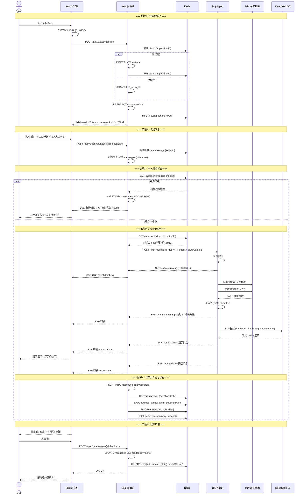
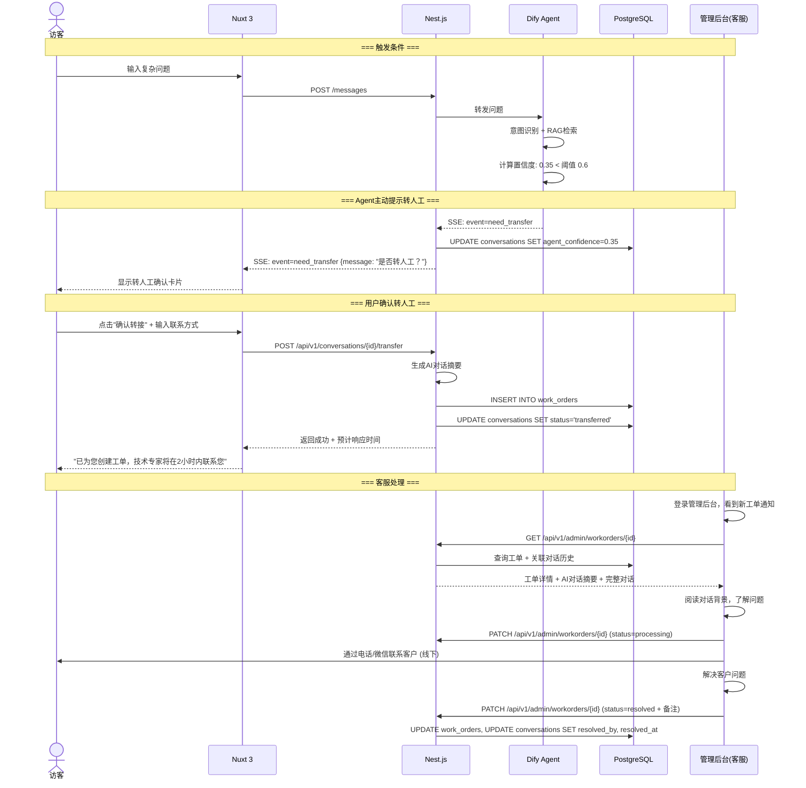
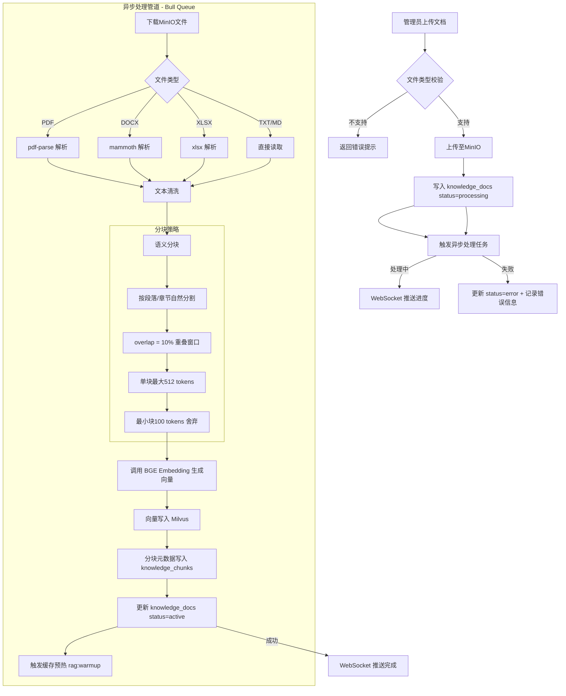
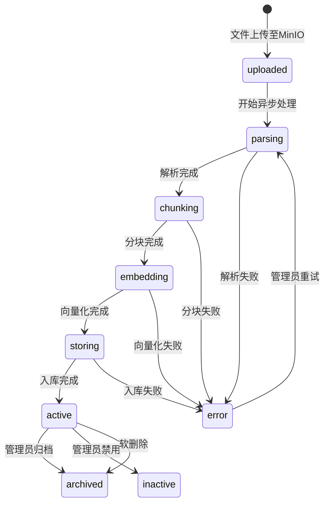
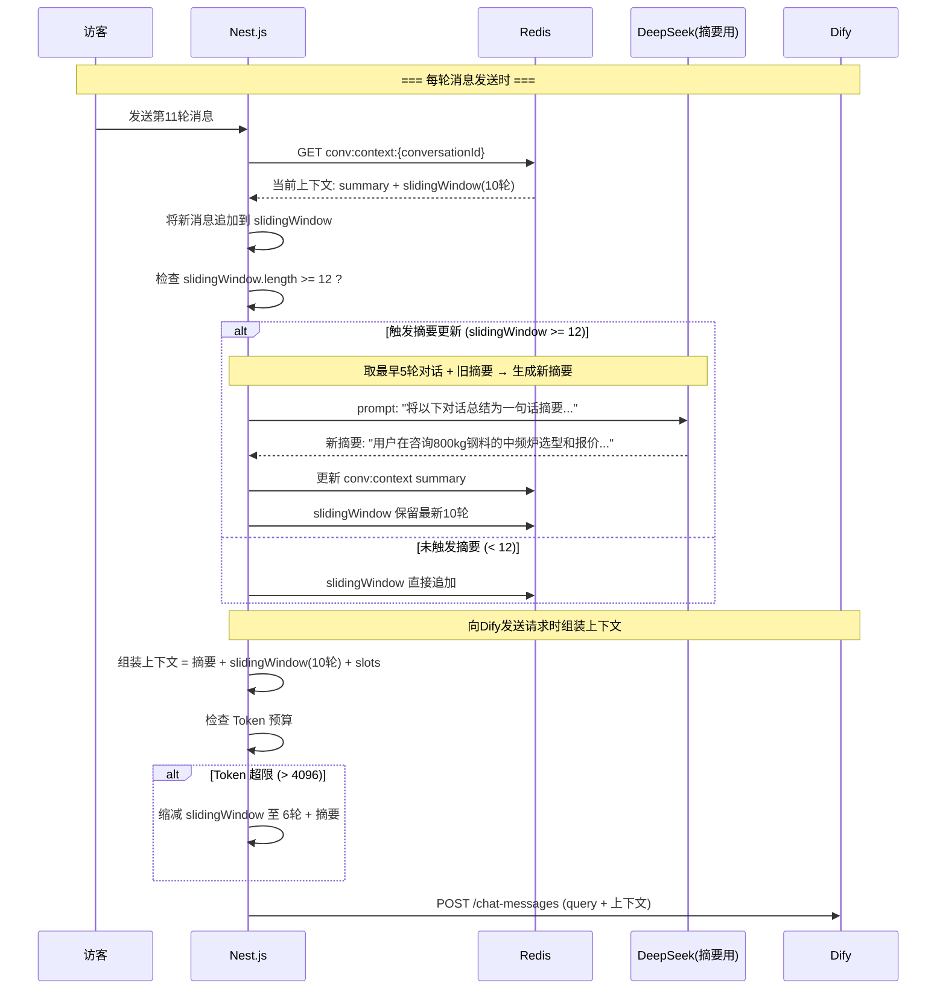
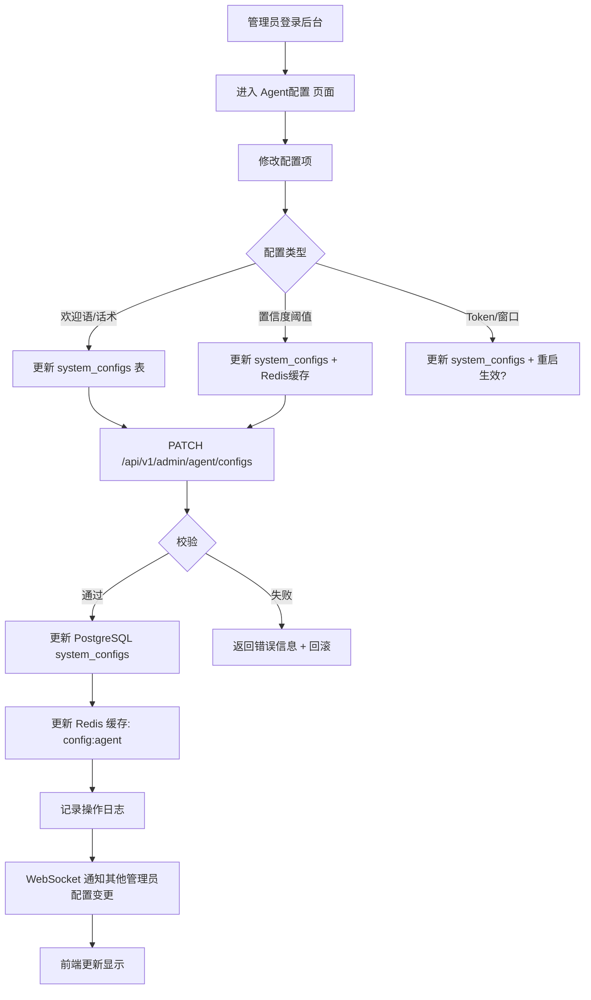
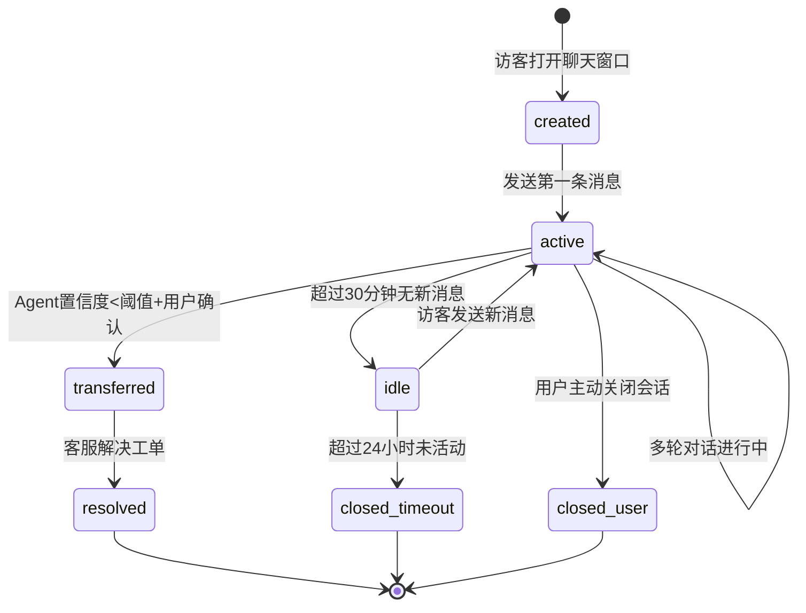

# 新鼎电炉科技——智能客服系统 业务流程设计

## 一、核心业务流程图索引

| 编号 | 流程 | 涉及模块 | 关键指标 |
|------|------|----------|----------|
| BP-01 | 访客咨询全流程 | Auth + Agent + RAG | 首包延时 < 3s |
| BP-02 | 转人工流程 | Agent + WorkOrder | 置信度阈值 0.6 |
| BP-03 | 知识库文档入库流程 | Knowledge + Milvus | 处理时间 < 2min |
| BP-04 | 多轮对话上下文管理 | Agent + Context Manager | Token预算控制 |
| BP-05 | 管理员配置Agent流程 | Admin + Agent | — |
| BP-06 | 未命中知识监测与补充 | Analytics + Knowledge | 每周Top 10审查 |
| BP-07 | 限流与降级流程 | Rate Limiter + Gateway | 系统可用性 99.5% |

---

## 二、BP-01：访客咨询全流程



**关键决策点**：
1. **会话初始化**：老访客复用已有visitor记录，不重复创建
2. **RAG缓存命中**：与LLM生成结果等价，但响应时间从秒级→毫秒级
3. **意图路由**：Dify内部根据意图分发到不同处理节点（产品咨询→检索知识库 / 闲聊→预设回复）

---

## 三、BP-02：转人工流程



**置信度计算逻辑**（在Dify工作流中配置）：
```
confidence = 
  retrieval_score × 0.5        // RAG检索相关性
  + intent_clarity × 0.3       // 意图识别清晰度
  + answer_consistency × 0.2   // 生成答案自洽性

if confidence < threshold (0.6):
  → 触发 need_transfer 事件
```

---

## 四、BP-03：知识库文档入库流程



**分块策略详解**：
```
文档结构:
┌─────────────────────────────────────────┐
│ 第1章 产品概述                            │
│   IGBT中频炉是一种...（200字）             │
│                                          │
│ 第2章 技术参数                            │
│   | 型号 | 功率 | 频率 | ...              │
│                                          │
│ 第3章 选型指南                            │
│   根据选型公式...（500字）                 │
└─────────────────────────────────────────┘

分块结果 (chunk_size=512, overlap=50):
  Chunk 0: "第1章 产品概述\nIGBT中频炉是一种..." (200 tokens)
  Chunk 1: "第2章 技术参数\n| 型号 | 功率 |..." (300 tokens)
  Chunk 2: "第2章 技术参数\n| 型号 | 功率 |...\n第3章 选型指南\n根据..." (512 tokens, 含overlap)
  Chunk 3: "第3章 选型指南\n根据选型公式..." (450 tokens)
```

**处理状态机**:


---

## 五、BP-04：多轮对话上下文管理流程



**Token预算计算逻辑**:
```typescript
interface TokenBudget {
  maxTokens: number;          // 4096
  summaryTokens: number;      // ~200
  slotsTokens: number;        // ~50
  eachRoundTokens: number;    // ~200 (用户+AI各约100)
  reservedForAnswer: number;  // 1500 (留给LLM生成答案的预算)
}

function calculateWindowSize(budget: TokenBudget): number {
  const availableForHistory = budget.maxTokens
    - budget.summaryTokens
    - budget.slotsTokens
    - budget.reservedForAnswer;

  // 可用历史预算 / 每轮Token ≈ 能保留的轮数
  const maxRounds = Math.floor(availableForHistory / budget.eachRoundTokens);

  return Math.min(maxRounds, config.slidingWindowSize); // 最多10轮
}
```

---

## 六、BP-05：管理员配置Agent流程



---

## 七、BP-06：未命中知识监测与补充流程

```mermaid
flowchart TD
    subgraph DailyAutomation [每日自动分析 - Cron: 每天凌晨2点]
        A1[查询昨日数据] --> A2[筛选 confidence < 0.6 的消息]
        A2 --> A3[按问题相似度聚类 - BGE Embedding]
        A3 --> A4[生成"未命中问题Top 10"清单]
        A4 --> A5[存入 stats:unanswered:date]
    end

    subgraph AdminReview [管理员审查 - 每周一]
        B1[管理员查看数据看板] --> B2[查看未命中清单]
        B2 --> B3{判断原因}
        B3 -->|知识库缺失| B4[准备补充文档/FAQ]
        B3 -->|意图路由错误| B5[调整Agent配置/提示词]
        B3 -->|问题本身无意义| B6[忽略/标记已处理]
        B4 --> B7[上传新文档 → BP-03流程]
        B5 --> B8[更新Agent配置 → BP-05流程]
    end

    subgraph Verification [验证闭环]
        C1[补充知识后重新测试] --> C2{检索命中率提升?}
        C2 -->|是| C3[关闭该问题]
        C2 -->|否| C4[继续优化/标记为疑难]
    end

    DailyAutomation --> AdminReview
    AdminReview --> Verification
```

**聚类算法**（简化版）：
```typescript
async function clusterUnansweredQuestions(questions: Message[]): Promise<Cluster[]> {
  // 1. 批量向量化
  const embeddings = await batchEmbed(questions.map(q => q.content));

  // 2. 余弦相似度矩阵
  const clusters: Cluster[] = [];
  const visited = new Set<number>();

  for (let i = 0; i < questions.length; i++) {
    if (visited.has(i)) continue;
    const cluster: Cluster = { representative: questions[i], members: [questions[i]] };
    visited.add(i);

    for (let j = i + 1; j < questions.length; j++) {
      if (visited.has(j)) continue;
      const similarity = cosineSimilarity(embeddings[i], embeddings[j]);
      if (similarity > 0.85) {
        cluster.members.push(questions[j]);
        visited.add(j);
      }
    }
    clusters.push(cluster);
  }

  // 3. 按成员数量排序（越热门越靠前）
  return clusters.sort((a, b) => b.members.length - a.members.length).slice(0, 10);
}
```

---

## 八、BP-07：限流与降级流程

```mermaid
flowchart TD
    Start[请求到达 Nest.js] --> RateLimit{限流中间件检查}

    RateLimit -->|Redis 可用| RedisCheck[Redis 滑动窗口检查]
    RateLimit -->|Redis 不可用| DBFallback[PostgreSQL rate_limits 表降级]

    RedisCheck -->|未超限| Pass1[放行 + 计数器+1]
    RedisCheck -->|超限| Reject1[429 Too Many Requests]

    DBFallback -->|未超限| Pass2[放行]
    DBFallback -->|超限| Reject2[429 + 限流告警]

    Pass1 & Pass2 --> DifyCheck{Dify 可用?}
    DifyCheck -->|可用| NormalProcess[正常处理 → Agent回答]
    DifyCheck -->|不可用| Fallback1[返回预设兜底回复]

    Pass1 & Pass2 --> DeepSeekCheck{DeepSeek API 可用?}
    DeepSeekCheck -->|可用| NormalProcess
    DeepSeekCheck -->|不可用| Fallback2[Dify内部降级: 仅返回检索结果不生成]

    Pass1 & Pass2 --> MilvusCheck{Milvus 可用?}
    MilvusCheck -->|可用| NormalProcess
    MilvusCheck -->|不可用| Fallback3[仅用关键词匹配 + 返回有限答案]

    NormalProcess --> Return

    subgraph DegradationLevels [降级等级]
        L1[L1: 仅限流转为DB限流 - 基本功能正常]
        L2[L2: Dify不可用 - 返回预设回复: "客服系统维护中"]
        L3[L3: DeepSeek不可用 - 仅返回RAG检索片段不做生成]
        L4[L4: Milvus不可用 - 关键词匹配 + 提示转人工]
    end
```

**降级触发条件与恢复**：

```typescript
// 熔断器模式 (Circuit Breaker)
class CircuitBreaker {
  private failures = 0;
  private lastFailureTime = 0;
  private state: 'CLOSED' | 'OPEN' | 'HALF_OPEN' = 'CLOSED';
  private readonly THRESHOLD = 5;      // 连续失败5次打开
  private readonly TIMEOUT = 30000;    // 30秒后半开尝试

  async call<T>(fn: () => Promise<T>, fallback: () => Promise<T>): Promise<T> {
    if (this.state === 'OPEN') {
      if (Date.now() - this.lastFailureTime > this.TIMEOUT) {
        this.state = 'HALF_OPEN';
      } else {
        return fallback();
      }
    }

    try {
      const result = await fn();
      this.onSuccess();
      return result;
    } catch (error) {
      this.onFailure();
      return fallback();
    }
  }
}
```

---

## 九、完整的会话生命周期



---

## 十、定时任务清单

| Cron表达式       | 任务          | 说明                            |
| ------------- | ----------- | ----------------------------- |
| `0 2 * * *`   | 每日未命中分析     | 分析昨日低置信度问题，聚类生成清单             |
| `0 3 * * 0`   | 每周热问汇总      | 生成本周Top 20热问，发送邮件报告           |
| `0 4 1 * *`   | 每月分区创建      | 调用 create_monthly_partition() |
| `*/5 * * * *` | Redis缓存预热检查 | 检查活跃会话，确保上下文缓存不丢失             |
| `0 5 * * *`   | Token日消耗统计  | 统计昨日DeepSeek API调用量和费用        |
| `0 6 * * *`   | 数据看板昨日快照    | 将昨日最终数据快照存入PostgreSQL         |
